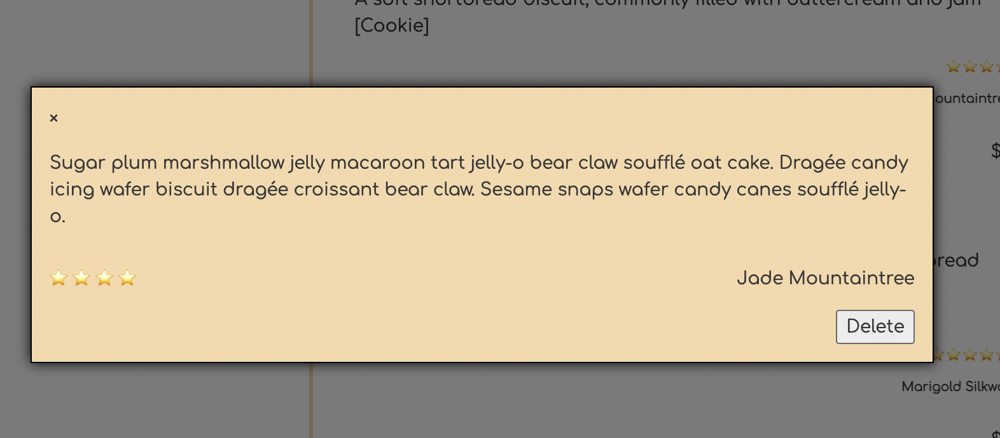
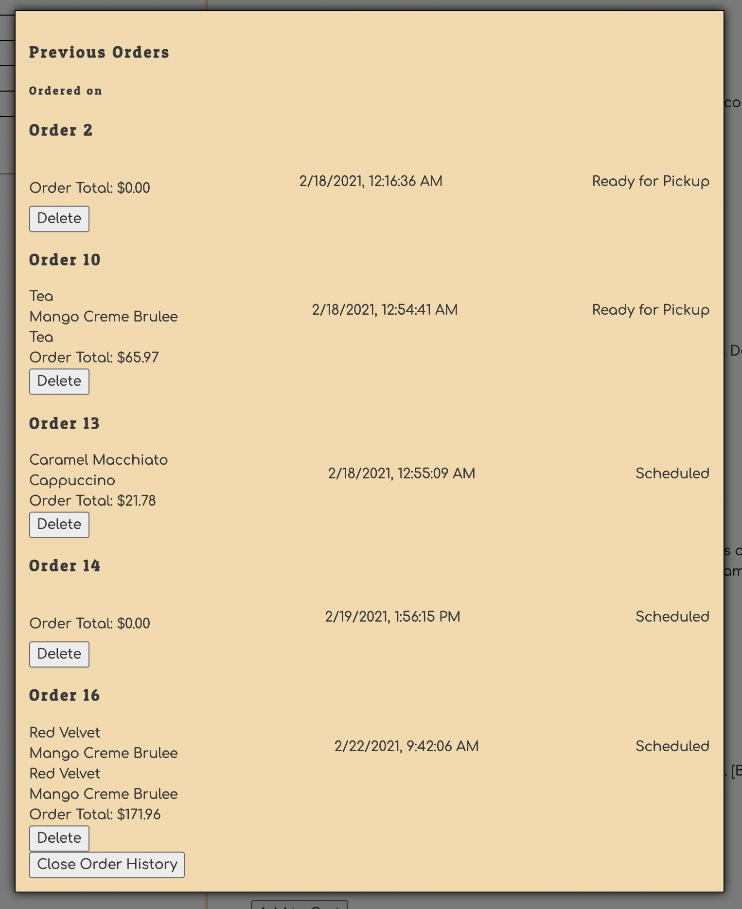
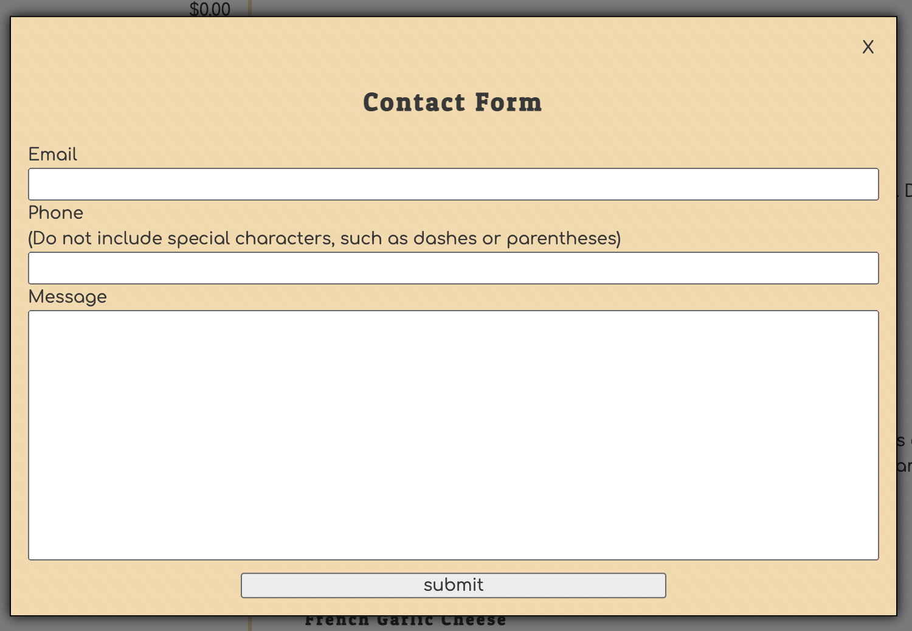

# Sprinkles of Joy ala Chewbakklava

## Description

This is a web application that serves as a portal for customers to interact with the local bakery Sprinkles of Joy and the services therein.

### Features
___
#### All visitors can:

* View a list (title, description, reviews) of all products
* Filter product list by product type (Cake, Drink, Cookie, Bread)
* Click on any star review to see more details about the review
* Send a message to the bakery via the contact form
* Build a cart by adding items to a cart
* See a live subtotal of all items in the cart
* Login to gain access to more features

#### Authorized users can:

* Place an order with at least one product in a cart
* Leave a review
* Delete their own reviews
* View their own order history
* Delete their own orders marked "ready for pickup"
* Logout

### Background

This application is meant to address the bakery's need to have a funcitonal online presence in which customers can view products, read and leave reviews, manage orders, and contact the bakery from the comfort of their personal computer, tablet, or phone.

## Visuals

* Landing Page (not signed in)
.png)
* Landing Page (signed in)
.png)
* Review Detail

* Write a review

* View Previous Orders

* Contact Form

## Installation

### Requirements

[json-server](https://www.npmjs.com/package/json-server)

### Instructions for Use
1. Clone or fork this repository to your machine
2. Run a server in the root directory of the project that serves index.html
3. Make a copy of the Settings.js.example file in the scripts directory and remove the .example extension.
4. Make a copy of the bakerydb.json.example file in the api directory and remove the .example extension.
5. Using [json-server](https://www.npmjs.com/package/json-server), serve `bakerydb.json` from the `api/` directory
6. Load the application in a web browser
    
## Support

* Please fill out an issue ticket if you run into any major issues or bugs that should be addressed.
* Those with access to the Nashville Software School slack can reach the devs `@amart` and `@Kaitlin Kelley`

## Roadmap

#### Future features could include:
* Implementing the ability to register as a user for the website
* Adding scroll functionality to modal windows
* Creating a "soft delete" functionality for orders the customer may not want to view anymore, but the bakery might like to keep a record of
* The ability to edit a user's own reviews
* The ability to join the rewards program as a user
* The ability to edit your cart (deleting a single item in your cart)
* Grouping similar cart items with an item count
* Altering aforementioned item count within the cart
* Sort and filter order history based on timestamp and status
* Create a more visually appealing confirmation that an order has been placed.
---
---
## Contributing

The more the merrier! Please feel free to fork this repository and create a pull request with any changes or improvements you can think of. 

That being said, we don't really maintain this project, so we probably won't read pull requests. Sorry `¯\_(ツ)_/¯`

Please use the Pull Request Template supplied in the root directory.

## Authors & Acknowledgements

Originally created by some people who left the project.

Recreated and rebuilt by [Alex Martin](https://github.com/SubtleCo) and [Kaitlin Kelley](https://github.com/kjk1325).

Beautifully supported by our illustrious and industrious instructors [Scott Silver](https://github.com/Scott47) and [Aja Washington](https://github.com/ajawashington).
Lead instructor - [Jisie David](https://github.com/jisie)

## License

Open source, but not really.
